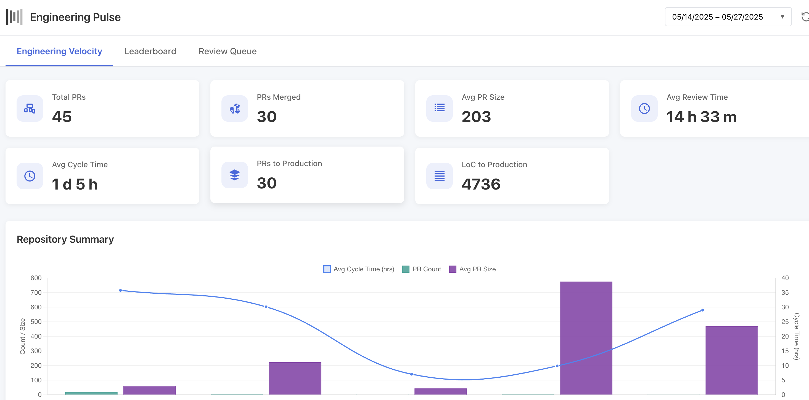
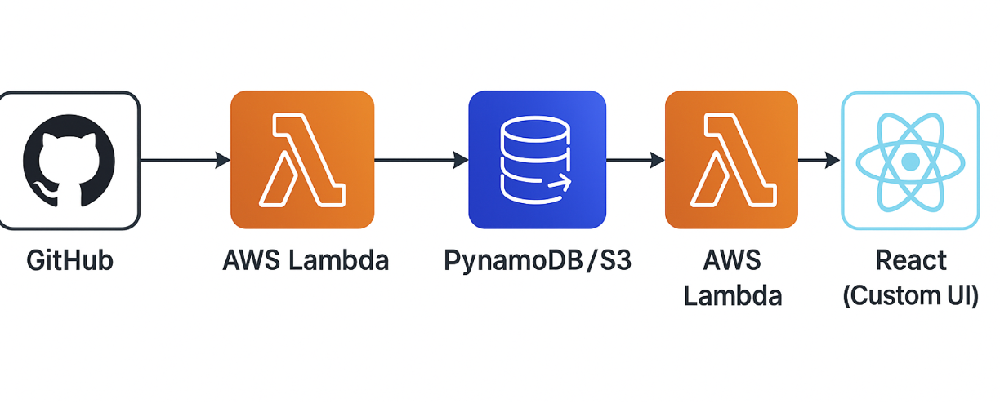
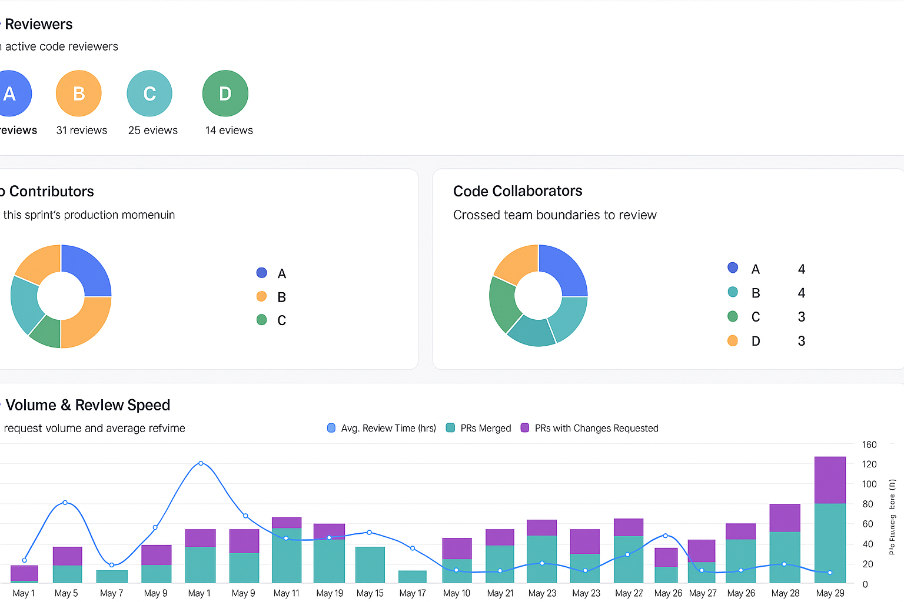

# Engineering Pulse

**Engineering Pulse — Fueling High-Performance Teams**

## Background

In modern software development, engineering teams are expected to move fast while maintaining high quality. But how do we know if we're actually improving? Traditional project status reports and delivery logs often fail to capture the nuances of engineering health and developer experience.

Engineering Pulse was born from that gap.

Through hands-on experience building developer platforms and tracking delivery across microservices, we realized most teams lacked a clear, consistent way to measure what matters—from pull request health to deployment stability.

Inspired by the DORA metrics and frameworks like SPACE, we built Engineering Pulse as a transparent, dashboard to:

- Give teams real-time insights into their software delivery process
- Promote data-informed retrospectives and sprint reviews
- Celebrate developer contributions and reduce bottlenecks
- Bridge the gap between engineering leaders and developers with actionable metrics

We believe that developers should not be measured by velocity alone, but by a balanced view of collaboration, quality, speed, and resilience.

Engineering Pulse is open source, opinionated yet extensible, and built to help every team take the next step in their DevOps journey—not by adding process, but by illuminating flow.

## Metrics Framework

Engineering Pulse builds on proven software delivery metrics including the DORA metrics (Deployment Frequency, Lead Time for Changes, Time to Restore Services, and Change Failure Rate) and extends them with team collaboration insights.

### Key Dashboard Views:

1. **Dashboard Overview**
   - Total PRs and PRs Merged
   - Average PR Size and Review Time
   - Average Cycle Time
   - PRs to Production and Lines of Code
   - Repository performance summaries

2. **Contributor Insights**
   - Top Reviewers and review distribution
   - Top Contributors and their impact
   - Code Quality Champions
   - Fastest Response Reviewers
   - Cross-team collaboration patterns

3. **PR Review & Merge Queue**
   - Active pull requests and their status
   - Review requested dates and merged dates
   - Filter by repository, author, and status
   - Detailed PR information including associated tickets

### Who Should Use Engineering Pulse

Engineering Pulse is ideal for:
- Engineering teams seeking data-driven improvement
- Team leads conducting sprint retrospectives
- Engineering managers balancing delivery and quality
- Organizations transitioning to DevOps practices



## Architecture

Engineering Pulse uses a simple, efficient architecture:

- **GitHub Webhooks** send PR and other events to AWS Lambda
- **AWS Lambda** processes events and stores them in DynamoDB
- **DynamoDB** stores all PR metrics and event data
- **S3** hosts the React-based UI that visualizes the metrics
- **Additional Lambda** functions retrieve data for the UI



### How Engineering Pulse Works

Events from your GitHub repositories flow through the system as follows:

1. GitHub sends webhook events (PRs, comments, reviews, etc.) to AWS Lambda
2. Lambda processes these events and stores structured data in DynamoDB
3. The React UI retrieves metrics from DynamoDB through API endpoints
4. The dashboard presents meaningful visualizations of your engineering metrics




## Prerequisites

- AWS account with permissions to create resources
- GitHub repository access (with webhook permissions)
- GitHub personal access token for webhook configuration


## Setup

```bash
# Clone the repo
git clone https://github.com/your-org/engineering-pulse.git
cd engineering-pulse

# Deploy using AWS CloudFormation template
# 1. Log in to AWS Console
# 2. Navigate to CloudFormation
# 3. Create Stack with the provided template
# 4. Follow the prompts to configure GitHub webhooks

# For local UI development
cd ui
npm install
npm start
```


## GitHub Webhook Configuration

After deployment, set up a webhook in your GitHub repo:

- **Payload URL**: your deployed API Gateway endpoint
- **Content type**: `application/json`
- **Secret**: must match your Lambda environment variable `GITHUB_SECRET`
- **Events**: `pull_request`, `deployment`, `deployment_status`


## Usage

Once configured, GitHub events like PR merges and deployments will:

- Be securely received via webhook
- Processed and stored in DynamoDB
- Analyzed to calculate key performance metrics
- Visible in the Engineering Pulse dashboard showing:
  - Pull request metrics and workflow health
  - Code review patterns and bottlenecks
  - Deployment stability and frequency
  - Team collaboration and contributions
  - Cycle time trends and optimization opportunities

### Visual Performance Indicators

The Engineering Pulse dashboard uses intuitive visual indicators to help teams quickly identify areas of strength and opportunities for improvement:

- **Color Coding**: 
  - **Purple/Green**: Elite/High performance
  - **Yellow**: Medium performance 
  - **Red**: Areas needing attention

- **Trend Analysis**: Charts and graphs show progress over time, helping teams track improvement
- **Comparison Views**: See how different repositories or team members compare

## Data Flow

The system organizes data in DynamoDB with the following structure:

- **PR Events**: Pull request creation, updates, reviews, and merges
- **User Activity**: Code review assignments and completions
- **Repository Metrics**: Aggregated statistics by repository

### Code Structure

- **lambda/**: AWS Lambda functions for processing GitHub events
- **ui/**: React-based dashboard for visualizing metrics
- **templates/**: AWS CloudFormation templates for deployment
- **scripts/**: Utility scripts for setup and configuration

## Customization

You can customize the platform by:

- Adding more GitHub event types (`issues`, `push`, etc.)
- Extending Lambda logic to calculate more insights
- Customizing DynamoDB queries for different metric definitions
- Modifying dashboard visualizations for specific team needs
- Integrating Slack or email notifications for metric thresholds
- Connecting to external BI tools (e.g., QuickSight, Grafana)


## Cleanup

To remove deployed infrastructure:

```bash
# 1. Log in to AWS Console
# 2. Navigate to CloudFormation
# 3. Delete the Engineering Pulse stack
```

Also remember to remove the GitHub webhook from your repository settings.


## Join the Mission

This project is a standing ovation for the engineers behind the code.  
We’re building it to spotlight effort, not just outcomes. Contributions welcome.
